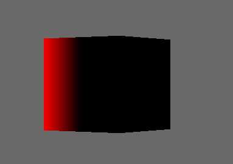
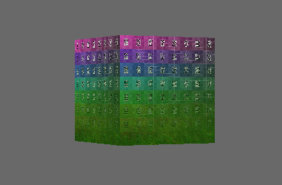

# panda3d_shading

After struggling with shading in panda3d for some time, I decided to give it another go.

And hey, it's actually not that bad.

here is a GLSL spec

# step 1, wtf is anyting?

# step 2, what are textures, 

where do they come from and how are they mixed and applied.

