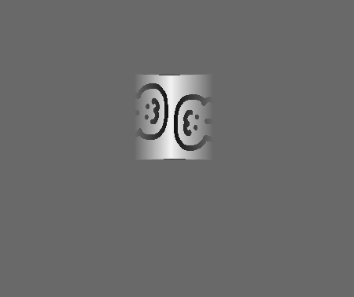
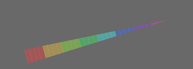

# panda3d_shading

After struggling with shading in panda3d for some time, I decided to give it another go.

The structure for this repo is that the scripts are numbered according to the sections below and should 'just work'.

this resource was really good:
https://github.com/lettier/3d-game-shaders-for-beginners
also shadertoy is a thing.

# dependencies

panda3d for rendering

`pip install panda3d`

step 3 uses my UI library over at [https://github.com/BMaxV/panda3d_interface_glue](https://github.com/BMaxV/panda3d_interface_glue)
but you can replace it with the regular `DirectButton` in panda if you prefer that.

`python3 setup.py install --user` that one.

here is a GLSL spec [https://registry.khronos.org/OpenGL/specs/gl/GLSLangSpec.4.60.pdf](https://registry.khronos.org/OpenGL/specs/gl/GLSLangSpec.4.60.pdf)

Here is the panda3d info that exists [https://docs.panda3d.org/1.10/python/programming/shaders/shader-basics](https://docs.panda3d.org/1.10/python/programming/shaders/shader-basics)

# step 1, wtf is anyting?

# step 2, what are textures, 

where do they come from and how are they mixed and applied.

# step 3, replacing textures 

for obvious recolors

# step 4, transparency

# step 6,

prepared models with uv mappings

# step 5, animated texture effects

on those models.

# step 7, world space transparency

using `p3d_ModelMatrix * p3d_vertex` to get the world space position of a glsl vertex, then in the fragment shader it's pretty trivial to take the magic number value of 20.5 (position of the cube + 0.5) and letting the cube become transparent with distance.

# step 8, UI shading

you can use all of that for UI elements as well, which gives more choice for styling and animating textures.

